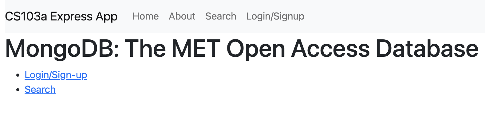

# The MET Open Access App

## Overview
The [Metropolitan Museum of Art](https://www.metmuseum.org/) of New York City, or colloquially "the MET", is the largest art museum in the Western Hemisphere and the fourth most visited art museum in the world. Over two million works reside in its permanent collection, with 17 curatorial departments ranging from Ancient Greek and Roman art to European paintings to Asian pieces to Modern art. With over 2.2 million square feet of space, it is impossible to fully explore what the MET has to offer within just a few visits.

Fortunately, the MET offers [open access](https://www.metmuseum.org/about-the-met/policies-and-documents/open-access) to more than 492,000 images of public-domain artworks through API. To demonstrate the use of MongoDB and HTML skills, this app is a platform through which users may view, search for, and interact with the art objects provided through the MET open access program.

As a minimum viable product, data for a sample art pieces selected from the MET open access API were uploaded to the cloud through MongoDB atlas from the API. The sample includes 20,000 Greek and Roman art pieces, as well as 2,000 modern art pieces. Users with an account may search for and view artworks based on artist, title, cuture, date, department, etc. Users may also star certain pieces they like, wish to know more about, or wish to visit.

## Access and Installation
The link to the app can be found [here](https://frozen-coast-24672.herokuapp.com/). To install locally, however, the mongoDB server link is required.

With your command prompt terminal, download the project from github in your folder of choice with

```bash
git clone https://github.com/IriaWang/cs103a-cpa02
```

Install nodemon (the node monitoring app) and start the project with

```bash
npm install -g nodemon
nodemon
```

In the cloned folder, write a file called startup.sh with the following

```bash
export mongodb_URI='mongodb+srv://<mongodb_server_link'
echo "connecting to $mongodb_URI"
nodemon
```

where the special link, not provided publicly, would be in that first line. To run, then simply run startup.sh.

## Using the App (demonstration)

Users may view art pieces, make queries to search for objects of interest, and star specific pieces that may interest the user. Starred pieces and searches are linked to a user account.

### Login

After launching the app, the following screen can be seen. Click on the login/sign-up link.

