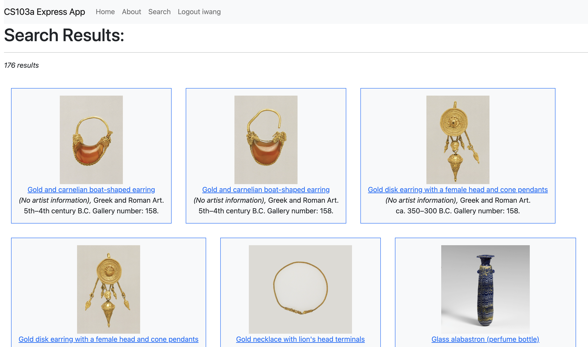

# The MET Open Access App

## Overview
The [Metropolitan Museum of Art](https://www.metmuseum.org/) of New York City, or colloquially "the MET", is the largest art museum in the Western Hemisphere and the fourth most visited art museum in the world. Over two million works reside in its permanent collection, with 17 curatorial departments ranging from Ancient Greek and Roman art to European paintings to Asian pieces to Modern art. With over 2.2 million square feet of space, it is impossible to fully explore what the MET has to offer within just a few visits.

Fortunately, the MET offers [open access](https://www.metmuseum.org/about-the-met/policies-and-documents/open-access) to more than 492,000 images of public-domain artworks through API. To demonstrate the use of MongoDB and HTML skills, this app is a platform through which users may view, search for, and interact with the art objects provided through the MET open access program.

As a minimum viable product, data for a sample art pieces selected from the MET open access API were uploaded to the cloud through MongoDB atlas from the API. The sample includes 20,000 Greek and Roman art pieces, as well as 2,000 european paintings. Users with an account may search for and view artworks based on artist, title, cuture, date, department, etc. Users may also star certain pieces they like, wish to know more about, or wish to visit.

## Access and Installation
The link to the app can be found [here](https://frozen-coast-24672.herokuapp.com/). To install locally, however, the mongoDB server link is required.

With your command prompt terminal, download the project from github in your folder of choice with

```bash
git clone https://github.com/IriaWang/cs103a-cpa02
```

Install nodemon (the node monitoring app) and start the project with

```bash
npm install -g nodemon
nodemon
```

In the cloned folder, write a file called startup.sh with the following

```bash
export mongodb_URI='mongodb+srv://<mongodb_server_link'
echo "connecting to $mongodb_URI"
nodemon
```

where the special link, not provided publicly, would be in that first line. To run, then simply run startup.sh.

## Using the App (demonstration)

Users may view art pieces, make queries to search for objects of interest, and star specific pieces that may interest the user. Starred pieces and searches are linked to a user account.

### Login

After launching the app, the following screen can be seen. Click on the login/sign-up link.


Then, on the next screen, login or sign up if you do not have an account. If you signed or logged in correctly, the brower will return you to the home screen with a logout button at the top bar.


### Search

Click on the search tab on the top bar or the link on the home page to start a new search. The search screen is as follows


The user can search through the database via a five different methods. The user can search by artist, title keyword, date, culture, or gallery number. Type in the query in the box and hit the submit button to the right.

* Artist: Type an artists's name, or part of an artist's name, and the app will return all objects by artists with names containing your input query. (e.g. David)
 
* Title Keyword: Type a keyword and the app wil return all objects that have titles containing that keyword. (e.g. jug)
 
* Date: Type in a year and the app will return all objects dated at that year, or dated around that year. (e.g. 500)
 
* Culture: Type in a nationality and the app will return all objects from that region, given that is it provided in the database. (e.g. Roman)
 
* Gallery number: Some items are on display and correspond to a gallery number. If you know that gallery number, then type it in and the app will return all items in the database located in the gallery. (e.g. 171, 174, 158)
 

